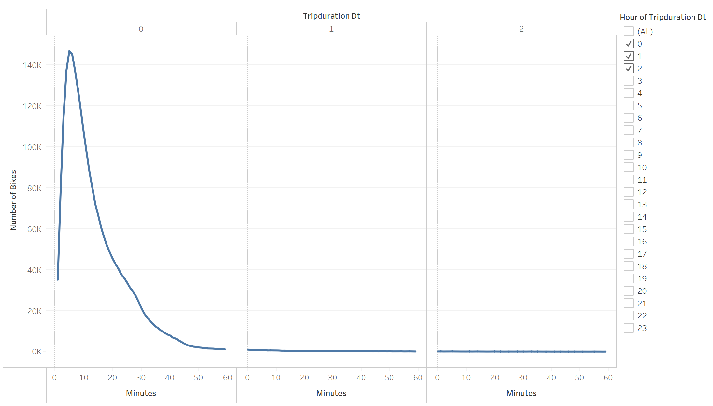
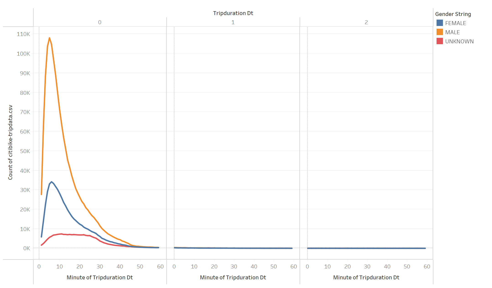
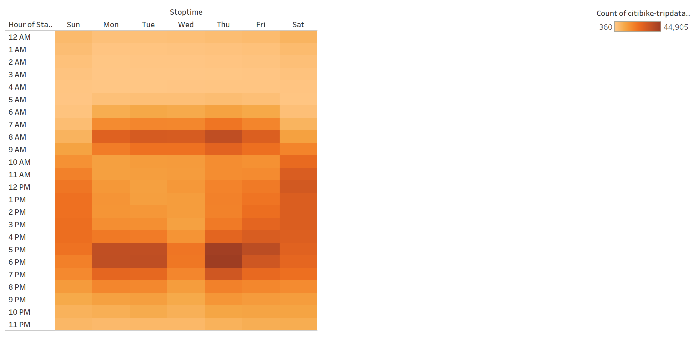
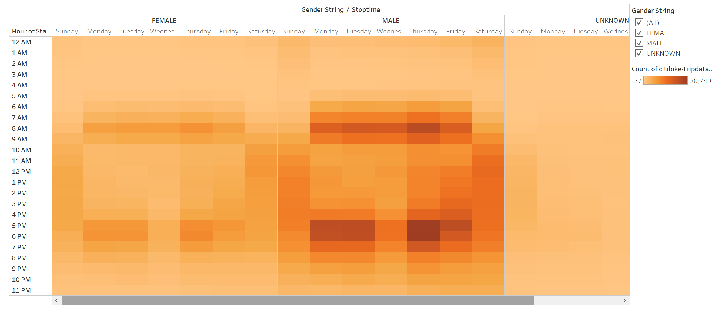
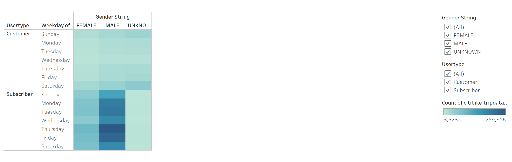
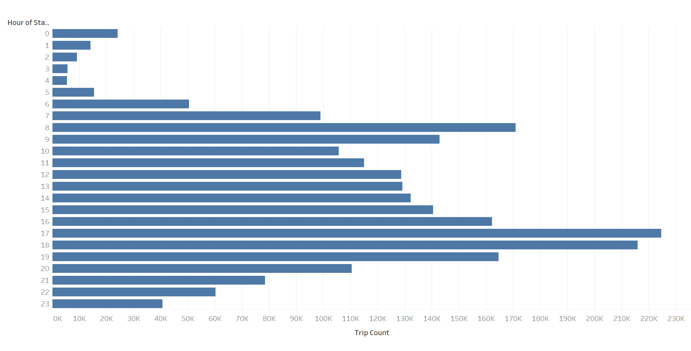

# Bike-Sharing

## Analysis Overview
The purpose of this analysis is to explore the idea and feasibility of a bike sharing business in Des Moine, Iowa. Since NYC bike sharing business was the inspiration behind this idea, the first step is to analyze NY Citibike data to understand how the business model works and then evaluate its feasibility for a smaller city like Des Moine. 

The scope of the anaysis is to put together a strong business proposal using key findings from NY Citibike data to provide investors/stakeholders confidence in backing a similar bike sharing business in Des Moine, Iowa.

## Results
In order to evaluate the feasibility of bike sharing business in Des Moine, its important to understand how the business model works using data from an already established market, NY CitiBikes.

Using CitiBike analysis, we will determine bike utilization, peak hours, target audience and maintenance schedule related details to learn more about the business model.

Lets first check how long are bikes usually checked out. This will give insight into checkout times patterns, to determine if there is a popular checkout duration.

  

**Checkout Times for All Users:**
The graph below shows the length of time that bikes are checked out for all riders. We can see that most riders typically rent the bike for approx 0-23 mins with the peak at 5 mins duration. So most of the rides are short distance which makes sense given that data is from NYC.

  

  

**Checkout Times by Gender:**
The chart below shows the length of time the bikes are checked out for each gender. Popular checkout is still approx 0-23 mins but we can clearly see that most rides are male.

  

  

**Trips by Weekday for Each Hour:**
This graph shows the number of bike trips by weekday for each hour of the day as a heatmap. This will help us understand the peak hours so that there is a high availability of bikes during that time.

We see two patterns: 1) Weekday peak hours are roughly between 7-10am and 5-8pm and (2) weekend peak hours are 10am-8pm with more riders renting bikes on Saturdays as compared to Sundays

  

  

**Trips by Gender (Weekday per Hour):**
This graph shows is similar to "Trips by Weekend for Each Hour" but with further details regarding gender as a heatmap. We see the same peak hour pattern here with further insight into gender distribution -  most of the users are male. 

  

  

**User Trips by Gender by Weekday:**
This graph shows the number of bike trips by gender for each day of the week as a heatmap with further breakdown into subscribers and customers. We can see that most of the business revenue is generated by susbscriptions.

  

  

The above observations provide insight into the ridership details by gender, the source of revenue, peak hours. Lets looks into peak hours in more details to understand how to identify bikes for maintenance and how to choose a maintenance window.

**August Peak Hours:**
Based on the chart below, and weekday trips by hour charts above, we can see that a maintenanve window of 2-4am is better suited for this business in NYC.

  

  

**Bike Utilization:**
The final chart provides a view into Bike utilization by showing total usage time per bike and what bikes are used the most. This will help identify bikes that may need to undergo repairs

  

  

## Summary
Overall, CNY CItibike analysis provides a few key insights into bike sharing business model in NYC.
- Most rides are 20 mins or less which means most riders use bikes for short distances. Based on Des Moines city's layout, this can help evaluate if bike sharing is a suitable business for the city.
- In terms gender, most riders are male
- A big chunk of revenue is generated by subscriptions
- Weekdays and weekends have different peak hour
- On Weekends, Saturday is busier than Sunday
- Overall, the business time of the week is Thursday from 5-7pm
- Bike maintenance window seems appropriate at 2-4am
- Bike utilization chart is a good view of bike needs repairs soon.

The analysis can benefit from these additional visualizations:
- A graph of total rides and total bike available for a given stations in a day (by hour). This can help determine if a certain station would require more bikes during peak hours. Based on the ride count, we can also determine how many bikes will be needed for a certain demand.
- Rider count by age to determine the age group that are most liekly to ride bikes. This information can be compared with Des Moines demographics to see if such a business is suitable
